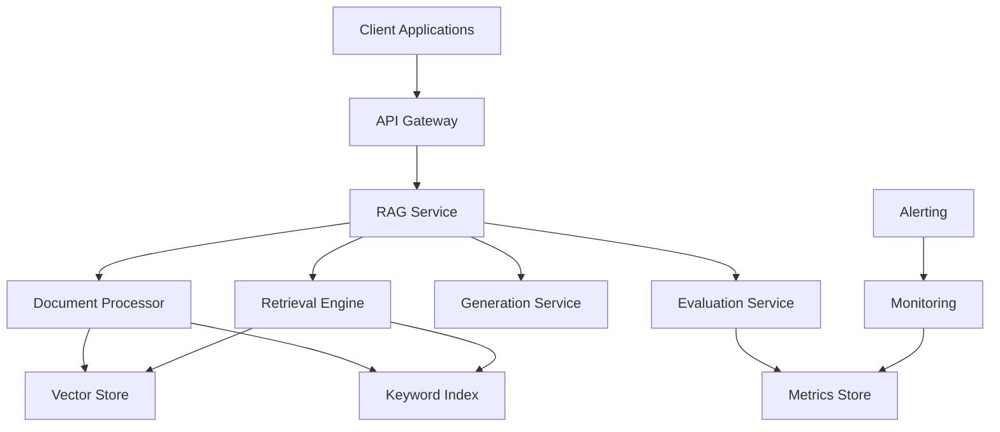

# Day 54: Project - Production RAG System

## Project Specification

### Executive Summary
Build a complete, enterprise-ready RAG system that demonstrates mastery of advanced retrieval techniques, evaluation frameworks, and production deployment practices. This system will serve as a capstone project integrating all concepts from Days 52-53.

## Business Context

**Company**: TechCorp Solutions  
**Use Case**: Internal Knowledge Management System  
**Users**: 500+ engineers, product managers, and support staff  
**Content**: 10,000+ technical documents, APIs, policies, and procedures  

### Business Requirements
- Enable instant access to company knowledge
- Reduce time spent searching for information by 70%
- Maintain high accuracy (>90%) for technical queries
- Support multiple query types (factual, procedural, troubleshooting)
- Integrate with existing tools (Slack, Confluence, Jira)

## Technical Specifications

### System Architecture



### Core Components

#### 1. Document Processing Pipeline
**Responsibility**: Ingest, process, and index documents

**Features**:
- Multi-format support (PDF, Markdown, HTML, DOCX)
- Intelligent chunking with overlap
- Metadata extraction and enrichment
- Embedding generation and storage
- Incremental updates and versioning

**Performance Requirements**:
- Process 1000 documents/hour
- Support files up to 50MB
- Maintain 99.9% processing success rate

#### 2. Hybrid Retrieval Engine
**Responsibility**: Find relevant contexts using multiple strategies

**Features**:
- Dense retrieval (vector similarity)
- Sparse retrieval (BM25/TF-IDF)
- Reciprocal Rank Fusion (RRF)
- Cross-encoder re-ranking
- Query expansion and reformulation

**Performance Requirements**:
- Retrieve results in <500ms
- Support 1000+ concurrent queries
- Maintain >0.8 context precision

#### 3. Generation Service
**Responsibility**: Generate accurate, contextual responses

**Features**:
- LLM integration (OpenAI, Anthropic, local models)
- Context optimization and truncation
- Response validation and filtering
- Citation and source attribution
- Multi-turn conversation support

**Performance Requirements**:
- Generate responses in <2 seconds
- Achieve >0.85 faithfulness score
- Support responses up to 2000 tokens

#### 4. Evaluation & Quality Service
**Responsibility**: Monitor and assess system quality

**Features**:
- Real-time RAGAS metrics calculation
- A/B testing framework
- Quality degradation detection
- Performance benchmarking
- Custom evaluation metrics

**Performance Requirements**:
- Evaluate 100% of responses
- Generate alerts within 1 minute
- Maintain evaluation overhead <10%

#### 5. API Gateway
**Responsibility**: Expose system functionality via REST API

**Features**:
- RESTful endpoints with OpenAPI spec
- Request/response validation
- Rate limiting and throttling
- Authentication and authorization
- Request tracing and logging

**Performance Requirements**:
- Handle 1000+ requests/second
- Maintain 99.99% availability
- Response time <100ms (excluding processing)

### Data Models

#### Document Schema
```json
{
  "id": "string",
  "title": "string",
  "content": "string",
  "metadata": {
    "source": "string",
    "author": "string",
    "created_at": "datetime",
    "updated_at": "datetime",
    "tags": ["string"],
    "category": "string",
    "version": "string"
  },
  "chunks": [
    {
      "id": "string",
      "content": "string",
      "embedding": [float],
      "start_char": int,
      "end_char": int
    }
  ]
}
```

#### Query Schema
```json
{
  "query": "string",
  "filters": {
    "category": ["string"],
    "tags": ["string"],
    "date_range": {
      "start": "datetime",
      "end": "datetime"
    }
  },
  "options": {
    "max_results": int,
    "use_reranking": boolean,
    "expand_query": boolean,
    "include_sources": boolean
  }
}
```

#### Response Schema
```json
{
  "answer": "string",
  "sources": [
    {
      "document_id": "string",
      "title": "string",
      "relevance_score": float,
      "excerpt": "string",
      "url": "string"
    }
  ],
  "metadata": {
    "query_id": "string",
    "processing_time": float,
    "model_used": "string",
    "evaluation_scores": {
      "faithfulness": float,
      "relevancy": float,
      "context_precision": float
    }
  }
}
```

## Implementation Plan

### Phase 1: Core Infrastructure (Day 1)
**Duration**: 4 hours  
**Deliverables**:
- Project structure and dependencies
- Docker containerization setup
- Basic API framework with FastAPI
- Database connections and models
- Logging and configuration management

**Key Tasks**:
1. Set up Python project with poetry/pip
2. Create Docker and docker-compose files
3. Implement basic FastAPI application
4. Configure logging with structured output
5. Set up environment-based configuration

### Phase 2: Document Processing (Day 1-2)
**Duration**: 6 hours  
**Deliverables**:
- Document ingestion pipeline
- Text processing and chunking
- Embedding generation and storage
- Metadata extraction and indexing

**Key Tasks**:
1. Implement multi-format document loaders
2. Create intelligent chunking strategies
3. Integrate embedding models (OpenAI, Sentence Transformers)
4. Set up vector database (Chroma/FAISS)
5. Build keyword indexing with BM25

### Phase 3: Retrieval Engine (Day 2)
**Duration**: 6 hours  
**Deliverables**:
- Hybrid search implementation
- Re-ranking system
- Query processing pipeline
- Context optimization

**Key Tasks**:
1. Implement dense and sparse retrieval
2. Build Reciprocal Rank Fusion
3. Integrate cross-encoder re-ranking
4. Add query expansion capabilities
5. Optimize context selection and ranking

### Phase 4: Generation Service (Day 2)
**Duration**: 4 hours  
**Deliverables**:
- LLM integration
- Response generation pipeline
- Context management
- Output validation

**Key Tasks**:
1. Integrate LLM APIs (OpenAI, Anthropic)
2. Implement context optimization
3. Build response validation
4. Add citation and source attribution
5. Handle error cases and fallbacks

### Phase 5: Evaluation System (Day 2)
**Duration**: 4 hours  
**Deliverables**:
- RAGAS metrics integration
- Real-time evaluation
- Quality monitoring
- A/B testing framework

**Key Tasks**:
1. Implement RAGAS evaluation pipeline
2. Build real-time quality monitoring
3. Create alerting system
4. Set up A/B testing infrastructure
5. Add custom evaluation metrics

### Phase 6: API & Integration (Day 2)
**Duration**: 3 hours  
**Deliverables**:
- Complete REST API
- Request validation
- Error handling
- API documentation

**Key Tasks**:
1. Complete API endpoint implementation
2. Add comprehensive error handling
3. Implement rate limiting
4. Generate OpenAPI documentation
5. Add health check endpoints

### Phase 7: Testing & Quality (Day 2)
**Duration**: 3 hours  
**Deliverables**:
- Unit and integration tests
- Performance benchmarks
- Quality validation
- Test automation

**Key Tasks**:
1. Write comprehensive test suite
2. Implement performance benchmarks
3. Add quality validation tests
4. Set up test automation
5. Create test data and fixtures

### Phase 8: Deployment & Monitoring (Day 2)
**Duration**: 2 hours  
**Deliverables**:
- Production deployment
- Monitoring setup
- Documentation
- Operational procedures

**Key Tasks**:
1. Finalize Docker deployment
2. Set up monitoring and alerting
3. Create deployment documentation
4. Write operational runbooks
5. Perform end-to-end testing

## Acceptance Criteria

### Functional Requirements
- [ ] **Document Processing**: Successfully ingests and processes 1000+ documents
- [ ] **Hybrid Search**: Implements both dense and sparse retrieval with RRF
- [ ] **Re-ranking**: Integrates cross-encoder for improved precision
- [ ] **Generation**: Produces accurate, contextual responses with citations
- [ ] **Evaluation**: Calculates RAGAS metrics for all responses
- [ ] **API**: Provides complete REST API with proper validation
- [ ] **Monitoring**: Tracks performance and quality metrics

### Performance Requirements
- [ ] **Response Time**: <2 seconds end-to-end (95th percentile)
- [ ] **Throughput**: Handles 100+ concurrent requests
- [ ] **Accuracy**: Achieves >0.8 average RAGAS scores
- [ ] **Availability**: Maintains 99.9% uptime
- [ ] **Scalability**: Processes 10,000+ documents efficiently

### Quality Requirements
- [ ] **Test Coverage**: >80% code coverage with unit/integration tests
- [ ] **Error Handling**: Graceful handling of all error conditions
- [ ] **Security**: Implements authentication and input validation
- [ ] **Documentation**: Complete API docs and deployment guides
- [ ] **Monitoring**: Real-time metrics and alerting configured

### Production Readiness
- [ ] **Containerization**: Fully containerized with Docker
- [ ] **Configuration**: Environment-based configuration management
- [ ] **Logging**: Structured logging with appropriate levels
- [ ] **Health Checks**: Comprehensive health and readiness endpoints
- [ ] **Observability**: Metrics, tracing, and monitoring integrated

## Evaluation Rubric

### Technical Implementation (40%)
- Architecture design and component separation
- Code quality, organization, and best practices
- Performance optimization and efficiency
- Error handling and edge case management

### RAG System Quality (30%)
- Retrieval accuracy and relevance
- Generation quality and faithfulness
- Integration of advanced techniques
- Evaluation framework implementation

### Production Readiness (20%)
- Deployment and containerization
- Monitoring and observability
- Documentation and maintainability
- Security and operational considerations

### Innovation & Extras (10%)
- Creative solutions and optimizations
- Additional features beyond requirements
- Integration with external tools
- Advanced evaluation techniques

## Resources & References

### Technical Documentation
- [FastAPI Best Practices](https://fastapi.tiangolo.com/tutorial/)
- [RAGAS Documentation](https://docs.ragas.io/)
- [LangChain RAG Patterns](https://python.langchain.com/docs/use_cases/question_answering)
- [Vector Database Comparison](https://github.com/chroma-core/chroma)

### Production Examples
- [Retrieval-Augmented Generation for Knowledge-Intensive NLP Tasks](https://arxiv.org/abs/2005.11401)
- [Building Production-Ready RAG Applications](https://blog.langchain.dev/building-production-ready-rag-applications/)
- [Enterprise RAG Architecture Patterns](https://www.pinecone.io/learn/rag-architecture/)

### Deployment & DevOps
- [Docker Best Practices](https://docs.docker.com/develop/best-practices/)
- [Prometheus Monitoring](https://prometheus.io/docs/introduction/overview/)
- [Production ML Systems](https://madewithml.com/courses/mlops/)

## Submission Guidelines

### Code Submission
1. Complete implementation in `solution.py`
2. Include all necessary configuration files
3. Provide comprehensive test suite
4. Add detailed README with setup instructions

### Documentation Requirements
1. Architecture overview and design decisions
2. API documentation with examples
3. Deployment and operational guides
4. Performance benchmarks and evaluation results

### Demo Requirements
1. Live demonstration of core functionality
2. Performance metrics and quality scores
3. Monitoring dashboard walkthrough
4. Discussion of design decisions and trade-offs

## Success Metrics

### System Performance
- Average response time: <1.5 seconds
- 95th percentile response time: <2.5 seconds
- Concurrent user capacity: 200+ users
- Document processing rate: 500+ docs/hour

### Quality Metrics
- Average faithfulness score: >0.85
- Average relevancy score: >0.80
- Context precision: >0.75
- User satisfaction: >4.0/5.0

### Operational Metrics
- System uptime: >99.9%
- Error rate: <0.1%
- Alert response time: <5 minutes
- Deployment frequency: Daily capability

This project represents the culmination of your RAG system learning journey, demonstrating your ability to build production-ready AI systems that deliver real business value.
