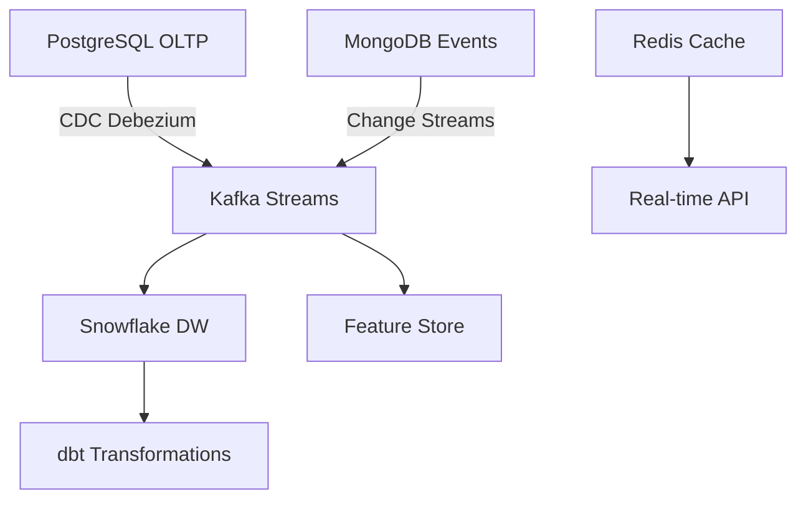

# Day 60: Capstone - Production System Integration

## Learning Objectives
By the end of this capstone project, you will be able to:
- Design and implement a complete end-to-end production data and AI system
- Integrate all major technologies from the 60-day curriculum into a cohesive platform
- Deploy a scalable, monitored, and cost-optimized ML platform on cloud infrastructure
- Demonstrate mastery of data engineering, MLOps, GenAI, and infrastructure best practices
- Build a portfolio-worthy project showcasing advanced data and AI engineering skills

⭐ **Capstone Project**: 2-hour comprehensive integration project combining all curriculum concepts

## Theory (30 minutes)

### Production System Architecture Overview

This capstone project integrates the entire 60-day curriculum into a production-ready **Intelligent Customer Analytics Platform** that demonstrates mastery of:

- **Data Engineering**: Real-time and batch data pipelines with CDC, Kafka, and Airflow
- **Data Governance**: Cataloging, lineage, privacy, and access control
- **ML Engineering**: Feature stores, model training, serving, and monitoring
- **GenAI Integration**: RAG systems, prompt engineering, and LLM applications
- **Infrastructure**: Kubernetes, Terraform, monitoring, and cost optimization

### System Architecture Components

#### 1. Data Layer (Days 1-11 Integration)


**Technologies Integrated:**
- PostgreSQL with advanced indexing and query optimization
- MongoDB for event data and user interactions
- Redis for real-time caching and session management
- Debezium CDC for real-time data capture
- Kafka for event streaming and data distribution
- Snowflake as the enterprise data warehouse

#### 2. Orchestration & Quality Layer (Days 12-24 Integration)
```python
# Airflow DAG integrating all data sources
from airflow import DAG
from airflow.operators.python import PythonOperator
from airflow.providers.postgres.operators.postgres import PostgresOperator
from airflow.providers.snowflake.operators.snowflake import SnowflakeOperator
from datetime import datetime, timedelta

default_args = {
    'owner': 'data-platform-team',
    'depends_on_past': False,
    'start_date': datetime(2024, 1, 1),
    'email_on_failure': True,
    'email_on_retry': False,
    'retries': 2,
    'retry_delay': timedelta(minutes=5)
}

dag = DAG(
    'customer_analytics_pipeline',
    default_args=default_args,
    description='End-to-end customer analytics with ML and GenAI',
    schedule_interval='@hourly',
    catchup=False,
    tags=['production', 'ml', 'genai', 'customer-analytics']
)
```

**Technologies Integrated:**
- Airflow for orchestration with dynamic DAGs and task groups
- dbt for data transformations with incremental models and testing
- Great Expectations for data quality validation
- DataHub for data cataloging and lineage tracking
- Apache Atlas for metadata management

#### 3. ML & Feature Engineering Layer (Days 25-39 Integration)
```python
# Feature store integration with Feast
from feast import FeatureStore, Entity, FeatureView, Field
from feast.types import Float64, Int64, String

# Customer entity for feature store
customer = Entity(
    name="customer_id",
    description="Customer identifier",
    value_type=String
)

# Real-time features from Redis
customer_realtime_features = FeatureView(
    name="customer_realtime_features",
    entities=[customer],
    schema=[
        Field(name="session_duration", dtype=Float64),
        Field(name="page_views", dtype=Int64),
        Field(name="cart_value", dtype=Float64),
    ],
    online=True,
    source=redis_source,
    ttl=timedelta(hours=1)
)
```

**Technologies Integrated:**
- Feast feature store for ML feature management
- MLflow for experiment tracking and model registry
- Advanced feature engineering with time series and NLP
- Model serving with FastAPI and Kubernetes
- A/B testing framework for model evaluation
- DVC for model versioning and data lineage

#### 4. GenAI & LLM Layer (Days 41-54 Integration)
```python
# RAG system for customer insights
from langchain.vectorstores import Chroma
from langchain.embeddings import OpenAIEmbeddings
from langchain.llms import OpenAI
from langchain.chains import RetrievalQA

class CustomerInsightRAG:
    def __init__(self):
        self.embeddings = OpenAIEmbeddings()
        self.vectorstore = Chroma(
            persist_directory="./customer_knowledge_base",
            embedding_function=self.embeddings
        )
        self.llm = OpenAI(temperature=0.1)
        self.qa_chain = RetrievalQA.from_chain_type(
            llm=self.llm,
            chain_type="stuff",
            retriever=self.vectorstore.as_retriever(search_kwargs={"k": 5})
        )
    
    def generate_customer_insights(self, customer_data: dict) -> str:
        """Generate personalized customer insights using RAG"""
        context = f"""
        Customer Profile:
        - ID: {customer_data['customer_id']}
        - Segment: {customer_data['segment']}
        - Lifetime Value: ${customer_data['ltv']}
        - Recent Behavior: {customer_data['recent_activity']}
        """
        
        query = f"Based on this customer profile, provide actionable insights and recommendations: {context}"
        return self.qa_chain.run(query)
```

**Technologies Integrated:**
- Transformer architecture for customer behavior modeling
- Fine-tuned models with LoRA for domain-specific tasks
- Advanced RAG system with vector databases
- Prompt engineering with DSPy for systematic optimization
- LLM serving optimization with vLLM and quantization

#### 5. Infrastructure & Monitoring Layer (Days 55-60 Integration)
```yaml
# Kubernetes deployment with monitoring
apiVersion: apps/v1
kind: Deployment
metadata:
  name: customer-analytics-api
  labels:
    app: customer-analytics
    component: api
spec:
  replicas: 3
  selector:
    matchLabels:
      app: customer-analytics
      component: api
  template:
    metadata:
      labels:
        app: customer-analytics
        component: api
      annotations:
        prometheus.io/scrape: "true"
        prometheus.io/port: "8080"
        prometheus.io/path: "/metrics"
    spec:
      containers:
      - name: api
        image: customer-analytics:latest
        ports:
        - containerPort: 8080
        env:
        - name: ENVIRONMENT
          value: "production"
        resources:
          requests:
            memory: "512Mi"
            cpu: "250m"
          limits:
            memory: "1Gi"
            cpu: "500m"
        livenessProbe:
          httpGet:
            path: /health
            port: 8080
          initialDelaySeconds: 30
          periodSeconds: 10
```

**Technologies Integrated:**
- AWS services (EKS, RDS, S3, Kinesis, Glue)
- Kubernetes for container orchestration
- Terraform for infrastructure as code
- Prometheus and Grafana for monitoring
- Cost optimization with spot instances and auto-scaling

### Business Context & Value Proposition

**Scenario**: You're the Senior Data & AI Engineer at **TechCommerce**, a rapidly growing e-commerce platform with 10M+ customers. The company needs a comprehensive customer analytics platform that:

1. **Processes real-time customer behavior** (clicks, purchases, support interactions)
2. **Predicts customer lifetime value** and churn probability
3. **Generates personalized recommendations** using ML models
4. **Provides AI-powered customer insights** for business teams
5. **Maintains data governance** and privacy compliance
6. **Scales cost-effectively** with business growth

### System Requirements

#### Functional Requirements
- **Real-time data ingestion** from multiple sources (web, mobile, support)
- **Batch processing** for historical analysis and model training
- **ML model serving** with sub-100ms latency for recommendations
- **GenAI-powered insights** for customer success teams
- **Self-service analytics** for business users
- **Automated data quality** monitoring and alerting

#### Non-Functional Requirements
- **Scalability**: Handle 100K+ events per second
- **Availability**: 99.9% uptime with graceful degradation
- **Security**: End-to-end encryption, RBAC, audit logging
- **Cost Efficiency**: Optimize for variable workloads
- **Compliance**: GDPR, CCPA data privacy requirements
- **Observability**: Comprehensive monitoring and alerting

### Architecture Patterns Applied

#### 1. Event-Driven Architecture
- **Event Sourcing**: Capture all customer interactions as immutable events
- **CQRS**: Separate read/write models for optimal performance
- **Saga Pattern**: Manage distributed transactions across services

#### 2. Microservices with Domain-Driven Design
- **Customer Domain**: Profile management, segmentation
- **Analytics Domain**: ML models, feature engineering
- **Insights Domain**: GenAI, recommendations, reporting
- **Platform Domain**: Infrastructure, monitoring, governance

#### 3. Lambda Architecture
- **Speed Layer**: Real-time processing with Kafka Streams
- **Batch Layer**: Historical processing with Airflow + dbt
- **Serving Layer**: Combined views in feature store and data warehouse

#### 4. MLOps Best Practices
- **Continuous Training**: Automated model retraining on new data
- **A/B Testing**: Safe model deployment with gradual rollout
- **Feature Store**: Centralized feature management and serving
- **Model Monitoring**: Drift detection and performance tracking

### Success Metrics

#### Technical Metrics
- **Data Freshness**: < 5 minutes for real-time features
- **Model Performance**: > 85% accuracy for churn prediction
- **API Latency**: < 100ms p95 for recommendation serving
- **System Availability**: > 99.9% uptime
- **Cost Efficiency**: < $0.10 per customer per month

#### Business Metrics
- **Customer Engagement**: +25% click-through rate on recommendations
- **Revenue Impact**: +15% conversion rate from personalized experiences
- **Operational Efficiency**: 50% reduction in manual analytics tasks
- **Time to Insight**: < 1 hour from data to actionable insights

## Project Implementation (90 minutes)

The capstone project is structured as a comprehensive integration exercise that demonstrates mastery of all curriculum concepts. You'll build a production-ready system step by step.

### Implementation Phases

#### Phase 1: Data Infrastructure (25 minutes)
Set up the foundational data layer with real-time and batch processing capabilities.

#### Phase 2: ML Pipeline (25 minutes)
Implement feature engineering, model training, and serving infrastructure.

#### Phase 3: GenAI Integration (25 minutes)
Add RAG-powered customer insights and recommendation enhancement.

#### Phase 4: Production Deployment (15 minutes)
Deploy to Kubernetes with monitoring, alerting, and cost optimization.

### Deliverables

1. **Complete System Architecture** - Terraform infrastructure code
2. **Data Pipeline Implementation** - Airflow DAGs with dbt transformations
3. **ML Model Pipeline** - Feature store, training, and serving code
4. **GenAI Application** - RAG system with customer insights API
5. **Monitoring Dashboard** - Grafana dashboards with key metrics
6. **Documentation** - Architecture decisions, deployment guide, API docs

## Resources

### Official Documentation
- [Airflow Production Deployment](https://airflow.apache.org/docs/apache-airflow/stable/production-deployment.html)
- [Feast Feature Store](https://docs.feast.dev/)
- [MLflow Model Registry](https://mlflow.org/docs/latest/model-registry.html)
- [LangChain RAG Tutorial](https://python.langchain.com/docs/use_cases/question_answering)
- [Kubernetes Best Practices](https://kubernetes.io/docs/concepts/configuration/overview/)

### Architecture References
- [Netflix ML Platform](https://netflixtechblog.com/machine-learning-platform-at-netflix-8dc2d2c0b0b4)
- [Uber's ML Platform](https://eng.uber.com/michelangelo-machine-learning-platform/)
- [Airbnb's Data Platform](https://medium.com/airbnb-engineering/data-infrastructure-at-airbnb-8adfb34f169c)

### Best Practices Guides
- [Google ML Engineering Best Practices](https://developers.google.com/machine-learning/guides/rules-of-ml)
- [AWS Well-Architected ML Lens](https://docs.aws.amazon.com/wellarchitected/latest/machine-learning-lens/welcome.html)
- [MLOps Principles](https://ml-ops.org/content/mlops-principles)

## Key Takeaways

- **Integration Mastery**: Successfully combining 60+ technologies into a cohesive system
- **Production Readiness**: Building systems that meet enterprise scalability and reliability requirements
- **End-to-End Ownership**: Taking responsibility for the complete data and AI lifecycle
- **Business Value**: Translating technical capabilities into measurable business outcomes
- **Architectural Thinking**: Making informed decisions about system design and technology choices
- **Operational Excellence**: Implementing monitoring, alerting, and cost optimization from day one
- **Continuous Improvement**: Building systems that can evolve with changing requirements
- **Cross-Functional Collaboration**: Creating systems that serve multiple stakeholders effectively

## What's Next: Your Data & AI Career

Congratulations! You've completed the 60 Days Advanced Data and AI bootcamp. You now have the skills to:

### Immediate Next Steps
- **Portfolio Development**: Showcase this capstone project in your professional portfolio
- **Certification Preparation**: Pursue AWS, GCP, or Azure ML certifications
- **Open Source Contribution**: Contribute to projects like Airflow, MLflow, or Feast
- **Community Engagement**: Join data engineering and MLOps communities

### Career Opportunities
- **Senior Data Engineer**: Design and build large-scale data platforms
- **MLOps Engineer**: Implement production ML systems and infrastructure
- **Data Platform Engineer**: Create self-service analytics and ML platforms
- **AI Engineer**: Build and deploy GenAI applications and LLM systems
- **Technical Lead**: Guide teams in data and AI architecture decisions

### Continuous Learning
- **Stay Current**: Follow industry trends in data engineering and AI
- **Deepen Expertise**: Specialize in specific domains (real-time systems, GenAI, etc.)
- **Leadership Skills**: Develop technical leadership and mentoring capabilities
- **Business Acumen**: Understand how data and AI drive business value

**You're now ready to tackle the most challenging data and AI engineering problems in production environments!** 🚀
